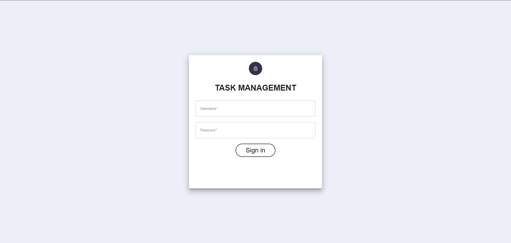
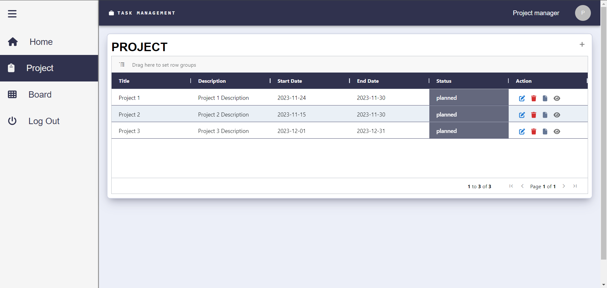

# TASK MANAGEMENT SYSTEM

A task management system is an application or system designed to efficiently organize and manage tasks, assignments, and projects.

## Prerequisite

Must have basic knowledge of Node, React, Express, MongoDB . I have made tutorial on each technology on YouTube , make sure to check it out. Links are Below respectively
Node - https://youtu.be/BSO9C8Z-YV8
React - https://youtu.be/99kgUCIMboY
Express - https://youtu.be/teipbke8c4A\
MongoDB - https://youtu.be/AYDP1S5BbTo
RestApi - https://youtu.be/AhCSfuG9Jxw (optional)

## Setting

1. Clone repository
2. For Backend - cd back-end npm i
3. For Frontend - cd front-end npm i

## Running the app

1. For Backend - cd back-end npm start
2. For Frontend - cd front-end npm start
3. Go to [This URL](http://localhost:3000/tasking) in browser

## Demo

### Login

### Home

